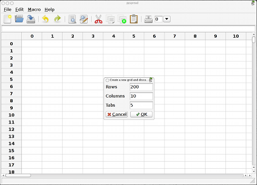
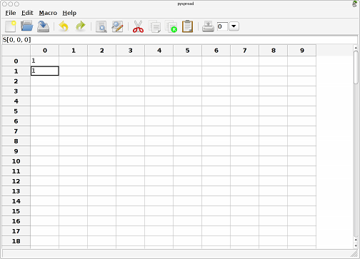
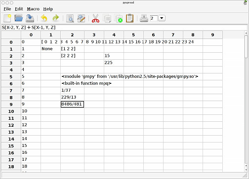

Tutorial
========================

## Running pyspread

Run pyspread with
```bash
$ pyspread
```     

- Select the Menu File → New
- Enter 200 rows, 10 columns and 5 tables in the pop-up menu.



After clicking OK, you get a new table with the typed-in dimensions.

## Standard cell commands

Select the top-left cell and type:
```py
1 + 5 * 2
``` 

The spreadsheet evaluates this Python statement and displays the result:
```py
11
``` 

In the cell that is one row below (cell (1, 0, 0)), type
```py
S
```    

As we see from the result, `S` is a known object. In fact, it is the grid object that we are currently working in.


## Absolute addressing of cells

To access a cell, we can index the grid. Replace `S` with
```py
S[0, 0, 0]
```    

and the same result as in the top-left cell that has the index `(0, 0, 0)` is displayed. The first index is the row, the second parameter is the column and the third parameter is the table.
Now replace the expression in the top-left cell by
```py
1
```    

Both cells change immediately because all visible cells are updated.



The main grid S can be sliced, too.
Write into cell `(3, 0, 0)`:
```py
S[:2, 0, 0]
```   

It now displays `[1 1]`, which is a list of the results of the cells in `[:2, 0, 0]`.

## Relative addressing of cells

Since cells are addressed via slicing, the cell content behaves similar to absolute addressing in other spreadsheets. In order to achieve relative addressing, three magic variables X (row), Y (column) and Z (table) are used.
These magic variables correspond to the position of the current cell in the grid.

Change to table 2 by selecting 2 in the iconbar combobox. Type into cell `(1, 2, 2)`:
```py
[X, Y, Z]
```   

The result is `[1 2 2]` as expected. Now copy the cell (Crtl-C) and paste it into the 
next lower cell (Ctrl-V). `[2 2 2]` is displayed. Therefore, relative addressing 
is achieved. Note that if cells are called from within other cells, the innermost 
cell is considered the current cell and its position is returned.

## Filling cells

The easiest method for filling cells with sequences is setting up an initial 
value and a function that calculates the next value.

Write into cell (1, 1, 2):
```py
0
```  

and into cell (2, 1, 2):
```py
S[X-1, Y, Z] + 1
``` 

Then copy cell (2, 1, 2), select the cells (3, 1, 2) to (99, 1, 2) and paste via <Crtl> + V. Now the 
cells (1, 1, 2) to (99, 1, 2) contain consecutive values.

Another way to fill cells is to create a list in one cell and 
use Edit -> Paste As... to distribute it into cells. Delete column 0 by selecting it 
and pressing the <del> key. Write into cell (0,0,2):
```py
range(99)
```  

A list appears in this cell. Copy the resulting list 
with <Shift> + <Ctrl> + C. (Make sure that you do not use the <Ctrl> + C command. This would 
copy the code, which results in an error message in the next step.) Move the 
cursor to cell (1,0,2) and press <Shift> + <Ctrl> + V. A dialog opens. Set 1 as object dimension. Do not 
check transpose. Press Ok. The cells are filled again. Finally, delete cell (0,0,0).

## Named cells

Cells can be named by preceding the Python expression with "<name> =". Type into cell (2, 4, 2):
```py
a = 3 * 5
```    

and in cell (3, 4, 2):
```py
a ** 2
```   

The results `15` and `225` appear. `a` is globally available in all cells.

## External modules

External modules can be imported into pyspread. Therefore, powerful types and 
manipulation methods are available.

Type into cell (5, 2, 2):
```py
fractions = __import__("fractions")
```

<module 'fractions' etc. is displayed. Now we redefine the rational number object in cell (6, 2, 2) in order to reduce typing and type in two rationals in the next two cells:
```py
p = fractions.Fraction("1/37")

q = fractions.Fraction("1/37")
```    

The results `1 / 37` and `229 / 13` appear.

In the next cell (9, 2, 2) type:
```py
S[X - 2, Y, Z] + S[X - 1, Y, Z]
```    

The result is 8486/481.



## Working with cells

Summing up cells:
The sum function sums up cell values. Enter into cell (16,2,2):
```py
sum(S[1:10,1,2])
```   

yields `36` as expected.

However, if there are more columns (or tables) to sum up, each row is summed up 
individually. Therefore, copying the data to column 0 and changing the cell (16,2,2) to
```py
sum(S[1:10,0:2,2])
``` 

yields `[36 36]`.

If everything shall be summed, the numpy.sum function has to be used:
```py
numpy.sum(S[1:10,0:2,2])
```    

yields `72`.

## Plotting

Pyspread renders a plot in any cell that returns a matplotlib figure. Merging the cell with other cells can increase plot size. In order to make generating plots easier, a chart dialog has been added to the Macros menu. This chart dialog generates a formula for the current cell. This formula uses a pyspread specific function that returns a matplotlib figure. You can use the object S inside the chart dialog window.

Switch to table 3.
Type into cell (0,0,3):
```py
math=__import__("math")
    

Type into cell (1, 0, 3):
```py
numpy.arange(0.0, 10.0, 0.1)
```    

Create the y value list in cell (2, 0, 3):
```py
[math.sin(x) for x in S[1, 0, 3]]
```    

Move the cursor to cell (2,2,3).
Now open the chart dialog window and enter
```py
S[1, 0, 3]
```   

for x values and
```py
S[2, 0, 3]
```    

for y values. A figure is displayed inside the dialog. Press Ok and a tiny figure is 
drawn inside the current cell. It scales with cell size. Increase cell sized by 
selecting the cells (2,2,3) to (12,5,3) and select press Format -> Merge cells.


