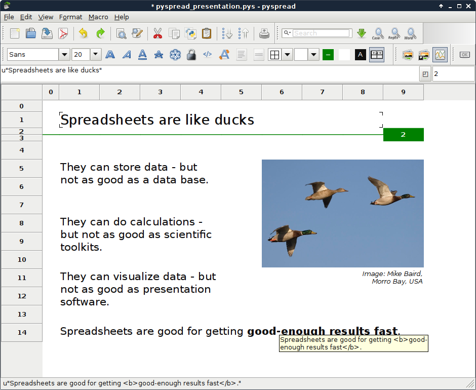
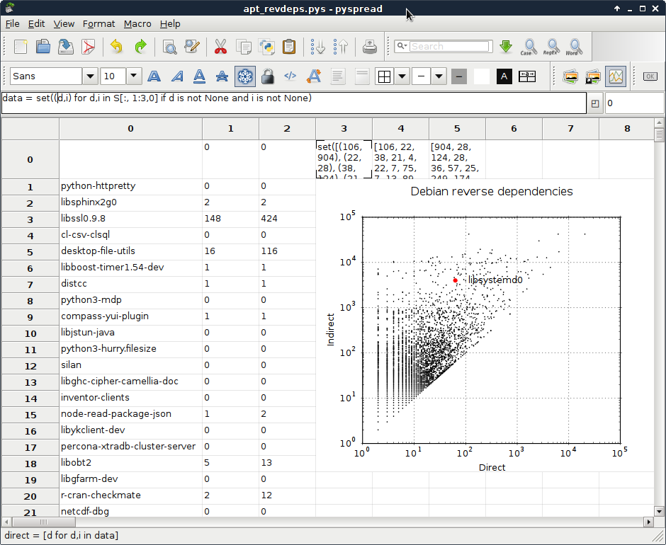

<div markdown="1" class="w3-container">
<div markdown="1" class="w3-col l2 m2 s12">
# Dependencies 
</div>
<div markdown="1" class="w3-col l6 m6 s12">
Pyspread works on Linux and other GTK platforms as well as on Windows.
While there have been reports that pyspread can be used on OS X as well,
OS X is currently unsupported.

Pyspread requires the following software to be installed:
* [Python](https://www.python.org){:target="_blank"} (&gt;=2.7, &lt;3.0)
* [numpy](https://www.numpy.org){:target="_blank"} (&gt;=1.1.0)
* [wxPython](https://www.wxpython.org){:target="_blank"} (&gt;=2.8.10.1, Unicode version required)
* [matplotlib](https://matplotlib.org){:target="_blank"} (&gt;=1.1.1)
* [pycairo](https://cairographics.org/pycairo){:target="_blank"} (&gt;=1.8.8)
* [python-gnupg](http://code.google.com/p/python-gnupg){:target="_blank"} (&gt;=0.3.0, for opening own files without approval)

The following optional dependencies improve user experience:
* [xlrd](http://www.python-excel.org){:target="_blank"} (&gt;=0.9.2, for loading Excel files)
* [xlwt](http://www.python-excel.org){:target="_blank"} (&gt;=0.9.2, for saving Excel files)
* [jedi](https://pypi.python.org/pypi/jedi){:target="_blank"} (&gt;=0.8.0, for tab completion and context help in the entry line)
* [pyrsvg](https://cairographics.org/download){:target="_blank"} (&gt;=2.32, for displaying SVG files in cells)
* [pyenchant](https://pypi.org/project/pyenchant){:target="_blank"} (&gt;=1.1, for spell checking)
* [Python bindings for libvlc](https://wiki.videolan.org/Python_bindings){:target="_blank"} (with libvlc.so.5, for video playback)
* [basemap](https://matplotlib.org/basemap){:target="_blank"} (&gt;=1.0.7, for the weather example pys file)
</div>
<div markdown="1" class="w3-col l4 m4 s12">
[{:width="100%"}](images/screenshot_presentation.png)
</div>
</div>

<div markdown="1" class="w3-container">
<div markdown="1" class="w3-col l2 m2 s12">
# Installation
</div>
<div markdown="1" class="w3-col l6 m6 s12">
## From source
1. Ensure that __all__ dependencies are installed.
2. Unpack the [source tarball](https://files.pythonhosted.org/packages/4b/34/3ce362d78584274da5c418c9712d3cc53b9e19e7d8f22a141baa2a9da6b9/pyspread-1.1.3.tar.gz#sha256=6e5d0eb49750eed7734852e15727e190270880c75dcc5f6c8fb1bfdaa59c48fc)
   ([gpg sig](https://pypi.io/packages/source/p/pyspread/pyspread-1.1.3.tar.gz.asc)).
3. cd to the extraction directory
4. Type in: ```python setup.py install```

## Linux

The following Linux distributions provide pyspread as a package:

|  | Arch | [pyspread v1.1.3](https://aur.archlinux.org/packages/pyspread/)
|  | Debian | [pyspread v1.1.3](https://packages.debian.org/de/sid/pyspread)
|  | Fedora | [pyspread v1.1.2](https://fedora.pkgs.org/28/rpm-sphere/pyspread-1.1.2-4.1.noarch.rpm.html)
|  | Mageia | [pyspread v1.1](https://madb.mageia.org/package/show/name/pyspread)
|  | NixOS | [pyspread v1.1.3](https://nixos.org/nixos/packages.html#pyspread)
|  | Slackware | [pyspread v1.1.3](https://slackbuilds.org/repository/14.2/office/pyspread/)
|  | Ubuntu | [pyspread v1.1.3](https://packages.ubuntu.com/eoan/pyspread)

For these distributions, the easiest way is to install
pyspread from the repositories. The source distribution can
also be used for example if the packaged version is outdated.

## Windows with installer

For version 1.1, a Windows 32 bit installer is available (Windows XP or later).
Note that the installer does not comprise all libraries that are used in the examples,
i.e. maps and videos in the grid will not work out of the box.

1. Download and install gnupg ([Gpg4win](https://www.gpg4win.org), supports
   32&amp;64bit). Note that version 2.2.6 works and version 3.x does not. 
   If you encounter issues please downgrade to 2.2.6.
2. Download the [pyspread installer](https://github.com/manns/pyspread/releases/download/v1.1.1/setup_pyspread_1.1.1.exe)
   (32MB download, 
   [gpg sig](https://github.com/manns/pyspread/releases/download/v1.1.1/setup_pyspread_1.1.1.exe.sig)).
3. Run the Setup file.

## Windows with manual installation

If you want to customize a Windows installation or if you require 64 bit then install pyspread manually.
Please follow these instructions. Links point at sites where both 32 bit and to 64 bit versions are provided.
1. Download and install Python, numpy and matplotlib.
   You can find 32bit and 64bit packages of WinPython [here](http://winpython.sourceforge.net).
   Make sure to get the Python2 version.
   If WinPython is used then the WinPython control panel is recommended for all installations.
2. Download and install Cairo and pycairo. Working binaries are available 
   [here](http://www.lfd.uci.edu/%7Egohlke/pythonlibs). 
   Note that Cairo has to be installed by manually copying it. 
   Make sure to read the installation instructions.
3. Download and install [wxPython 2.8.x or 3.x](http://www.wxpython.org/download.php#stable).
4. Download and install gnupg [Gpg4win](https://www.gpg4win.org) (supports
      32&amp;64bit)
5. Download and install
      [python-gnupg](http://pythonhosted.org/python-gnupg/#download).
      
      For **32 bit systems**, an exe installer
      (python-gnupg-0.3.4.win32.exe) is provided on the linked
      page. 
      
      For **64 bit systems**,
      the python-gnupg tarball (python-gnupg-0.3.4.tar.gz) has
      to be extracted (e.g. with 7zip) 
6. Download and install the source distribution of pyspread
7. Start pyspread by double-clicking on the file pyspread.bat in the extraction 
   directory.

*Last changed: 05. August 2019*
</div>
<div markdown="1" class="w3-col l4 m4 s12">
[{:width="100%"}](images/screenshot_apt.png)
</div>


