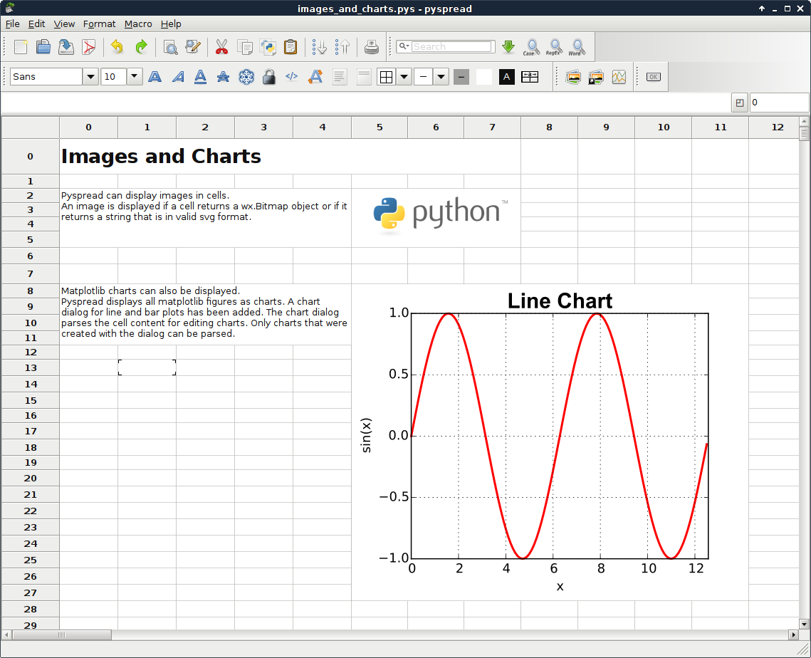
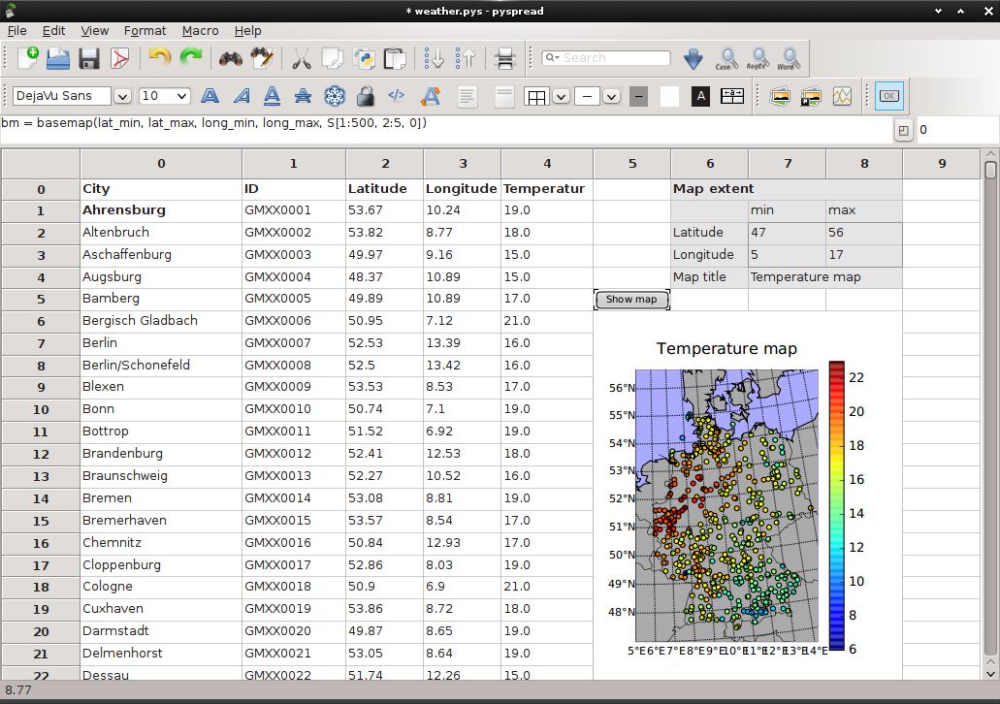
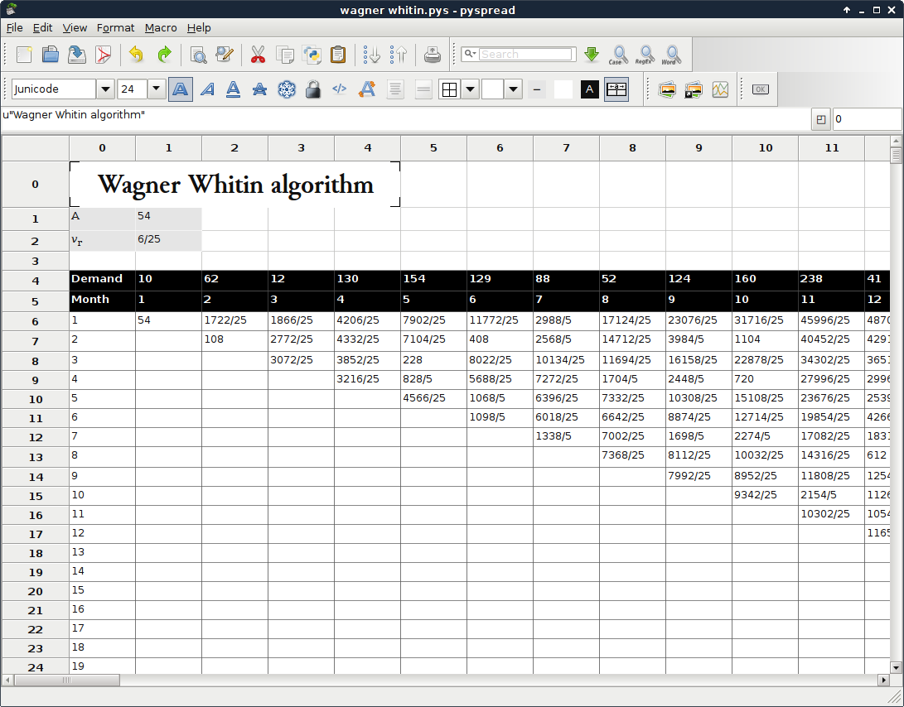

# About 

Pyspread is a non-traditional spreadsheet that is based on and written in the 
programming language [Python](https://www.python.org/){:target="_blank"}.

The goal of pyspread is to be the most pythonic spreadsheet.

Pyspread expects Python expressions in its grid cells, which makes a
spreadsheet specific language obsolete. Each cell returns a Python object that
can be accessed from other cells. These objects can represent anything
including lists or matrices.

Pyspread is free software. It is released under the 
[GPL v3](https://www.gnu.org/copyleft/gpl.html){:target="_blank"}.

The current release of pyspread runs on Python 2.7.x only.
A Python 3 compatible version is under development (see section 
[contribute](contribute.html)).

[{:width="100%"}](images/screenshot_sinus.png)

# Features 

* Cells accept Python code and return Python objects
* Access to Python modules from within cells including e.g.
  [NumPy](https://www.numpy.org/){:target="_blank"}
* Cells may display text, markup, images, charts or videos\*
* Code completion\*
* Spell checker\*
* Imports CSV, XLS\*, XLSX\*, ODS\*, SVG\*
* Exports CSV, PDF, XLS\*, SVG\*
* GIT-able pysu save file format
* GPG based save file signatures that prevent foreign code execution\*

\* *requires optional dependencies*

# Target group 

Directly using Python code in a grid is a core feature of pyspread.
The target user group has experience with or wants to learn the
programming language Python:
* Peter regularly documents layout planning projects. He already has
a large base of Python code for doing calculations in
this task. Peter has to provide project documentation in pdf files
with a consistant layout. In the documentation, he has to visualize
building layouts and calculation charts.
* Clara is a research engineer and wants to quickly create presentations
and posters with a consistent layout and publication ready figures for
her publications.
She is proficient with Python and uses it for her scientific analyses.

Not part of the target user group are Donna and Jack:
* Donna is looking for a free replacement for Ms. Excel.
She does not know any programming language.
* Jack does computation intensive data analysis that may take hours
to compute. He is looking for a visually interactive data mining
tool.

This does not mean that Donna or Jack cannot work with pyspread. However,
Donna might find the learning curve for using Python code in cells too steep.
Jack on the other hand might be disappointed because his long running tasks
are likely to lock up pyspread.

[{:width="100%"}](images/screenshot_basemap.png)

# Contact

For user questions or user feedback please contact the author via e-mail:
mmanns &lt; at &gt; gmx &lt; dot &gt; net.

For contributions, patches, development discussions and ideas please create
an issue using the 
[pyspread issue tracker](https://github.com/manns/pyspread/issues)

*Last changed: 29. July 2019*

[{:width="100%"}](images/screenshot_wagner.png)

